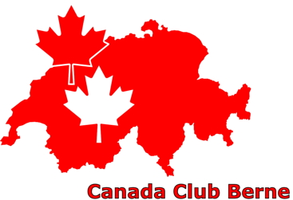
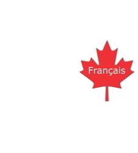

---
# Feel free to add content and custom Front Matter to this file.
# To modify the layout, see https://jekyllrb.com/docs/themes/#overriding-theme-defaults

layout: home
---

  

# About us

We are a group of Canadians, Canadian-Swiss and Swiss-Canadians who are organized as Canada Club Berne, which was founded in 1981 and has been going ever since.
We promote relaxed social contacts, Canadian style, among our members. Activities that might be organized by Club members during the year include a Canada Day picnic, Ascension Day biking or hiking, Christmas dinner, snowshoeing,  hiking, etc. Our events usually take place in the greater Bern region, though winter sports usually happen in higher, more snow-endowed areas.

New members — temporary or long-term — are very welcome, so feel free to contact us at [info@canadaclub.ch](mailto:info@canadaclub.ch).

# Next event

Hike, September 3, 2022

# New to Bern?

Here's an interesting guide to Bern, created by students at the University of Bern. It can be useful for newcomers to the region as well as anyone looking to live more sustainably in and around Bern.

Click [here](https://www.bne.unibe.ch/for_students/out_and_about_sustainably_in_bern/index_eng.html) to access the PDF

