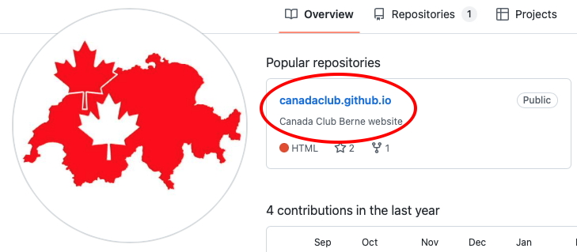
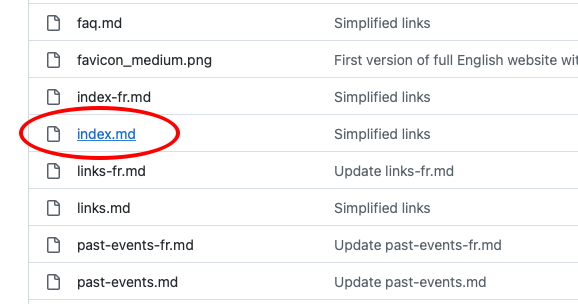
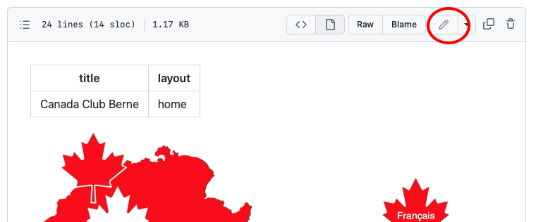
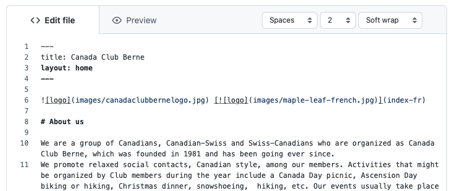
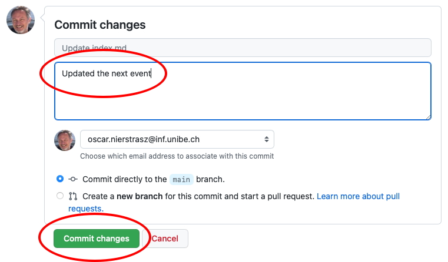

---
## Getting started

This website is organized as a bunch of simple text files in “markdown” format — a lightweight standard for formatting text.
You can easily edit any of the pages online, and the website will be updated usually within a minute.
All changes are tracked automatically, so you can't mess up — it is always possible to undo changes.


### 1. Get a github account

If you need to edit this website, the first thing to do is to [get an account on github](https://github.com/signup).
This is the platform that hosts and serves the web pages.

### 2. Ask to be added as a collaborator

Once you have an account, ask [Oscar](https://github.com/onierstrasz) to add you as a collaborator to the Canada Club website project.
This will let you edit and change pages.

---
## Editing pages

To edit pages, you just need to find the source file on the server, edit it, and commit your changes.

### 1. Find the source file

If you need to change a page, say the [home page](https://canadaclub.ch), you will need to find the source file on the [project page](https://github.com/canadaclub/canadaclub.github.io).

The link is at the bottom of each web page:



You will see a list of files in the project.
The ones that interest you all end in “.md” (for “markdown”).
For each web page there is an english file and a french one.
In this case you want to edit “index.md” — just click on it to open it.



### 2. Edit the file

Just click on the “pencil” icon to edit the page.



Now you can edit the page directly in the web browser!




### 3. Commit your changes

When you're done, go to the bottom of the page, write a short description of the change you made, and click on the “Commit changes” button.



That's it!
Usually within 30 seconds you can see your change on the actual website.

---
## About markdown

Markdown is pretty simple — it's intended to be.
To edit the pages, you probably only need to know a couple of things.
The header defines the title of the page.
You can change this if you like.
You shouldn't change the layout, however.

```
  ---
  title: Canada Club Berne
  layout: home
  ---
```

Headings start with a hash.
Add more hashes to increase the sub-heading level.

```
  # About us
```

If you want to make a link to another page, use the format `[DESCRIPTION](URL)`.

For example:

```
  [our FAQ](faq)
```

will generate an internal link to [our FAQ](faq), while


```
  [the Canada Club github profile](https://github.com/canadaclub)
```

generates an external link to [the Canada Club github profile](https://github.com/canadaclub).

That's probably enough to get started.
If you want to learn more about markdown and how to use it, have a look at [this cheatsheet](https://itopaloglu83.github.io/Jekyll-Markdown-Cheat-Sheet/).
